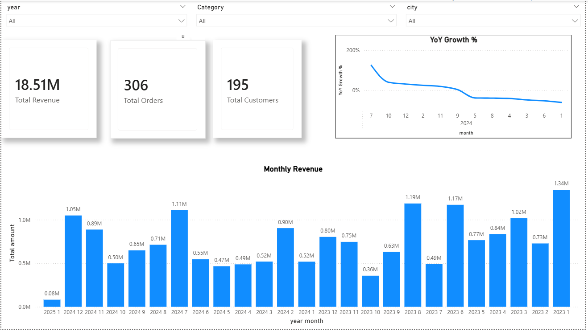
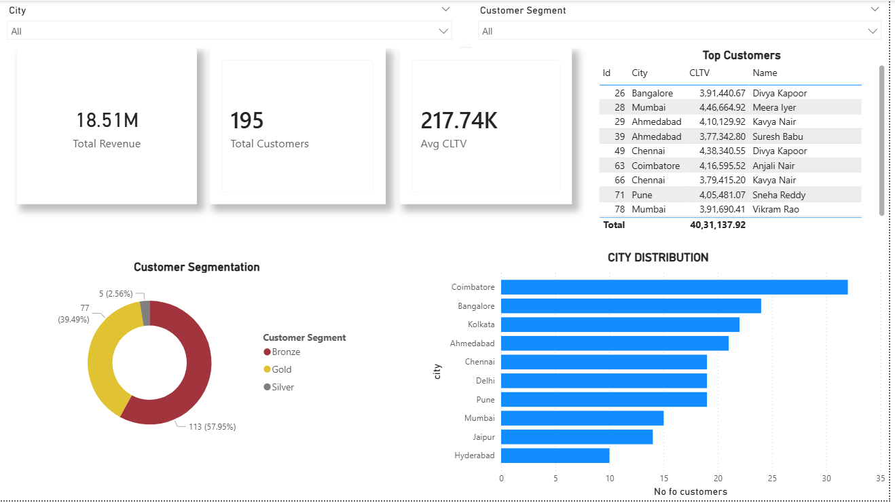
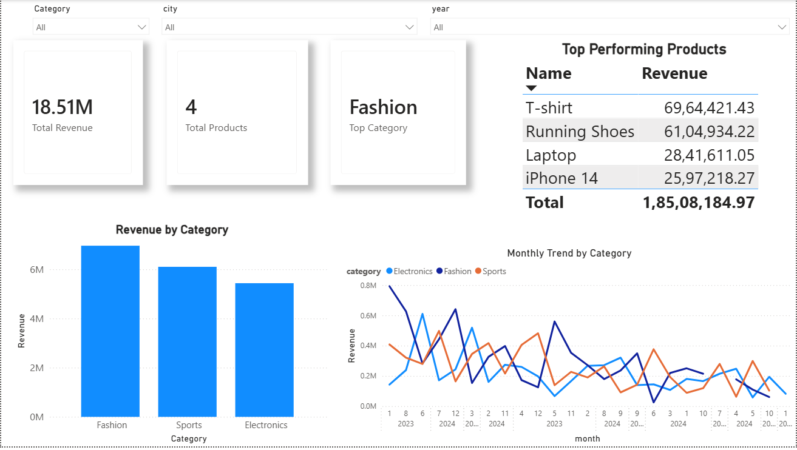

# 🛒 E-Commerce Data Warehouse & Analytics Dashboard

## 📌 Overview

This project demonstrates the design and implementation of an **end-to-end data analytics solution** for an e-commerce business. It covers the full pipeline from **OLTP schema → Data Warehouse (Star Schema) → Analytical Queries → Interactive Dashboard**.

The goal is to enable business stakeholders to analyze:

* Revenue trends
* Customer behavior
* Product performance

---

## 🏗️ Architecture

### 🔹 Step 1: OLTP Schema

Designed normalized transactional tables:

* Customers
* Orders
* OrderItems
* Products

---

### 🔹 Step 2: Data Warehouse (Star Schema)

Transformed OLTP data into a **Star Schema**:

* **Fact Table**

  * `FactSales`

* **Dimension Tables**

  * `DimCustomer` (SCD Type 2 implemented)
  * `DimProduct`
  * `DimDate`
  * `DimStore`

---

### 🔹 Step 3: ETL Process

* Loaded and transformed transactional data into the warehouse
* Implemented **Slowly Changing Dimensions (Type 2)** for customer history tracking
* Ensured clean and structured analytical data

---

## 📊 Key Metrics & Analysis

The project includes analytical queries and dashboard insights such as:

* 📈 **Monthly Revenue Trends**
* 📊 **Year-over-Year (YoY) Growth %**
* 👥 **Customer Lifetime Value (CLTV)**
* 🔁 **Repeat Purchase Behavior**
* 🥇 **Top Customers Analysis**
* 🛍️ **Top Products Performance**
* 🧩 **Category-wise Revenue Contribution**
* 🌍 **Customer Distribution by City**

---

## 📊 Dashboard

An interactive dashboard was built using **Microsoft Power BI** to visualize insights.

### 🔹 Features:

* KPI Cards (Revenue, Orders, Customers, CLTV)
* Monthly revenue trend analysis
* Customer segmentation (Gold / Silver / Bronze)
* City-wise customer distribution
* Product performance tracking
* Dynamic filters (Year, Category, City)

---

## 📸 Dashboard Screenshots

### 🔹 Overview Page

### 🔹 Customer Insights

### 🔹 Product Insights

---

## ⚙️ Tech Stack

* **SQL (PostgreSQL)**
* **Data Modeling (Star Schema, SCD Type 2)**
* **ETL Concepts**
* **Power BI (Data Visualization)**

---

## 🧠 Key Learnings

* Designed and implemented a **Star Schema** for analytics
* Applied **Slowly Changing Dimensions (Type 2)** for tracking historical changes
* Built complex analytical queries using:

  * CTEs
  * Window functions
  * Aggregations
* Translated raw data into **business insights through dashboards**
* Improved understanding of **OLTP vs OLAP systems**

---

## 🚀 How to Run This Project

1. Create database in PostgreSQL

2. Run SQL scripts in order:

   * `oltp_schema.sql`
   * `sample_data.sql`
   * `star_schema.sql`
   * `etl_queries.sql`

3. Open Power BI file:

   * `ecommerce_dashboard.pbix`

4. Refresh data to view dashboard

---

## 📌 Business Insights (Sample)

* Fashion category generates the highest revenue
* A small group of customers contributes a large portion of total sales
* Customer segmentation reveals majority fall into mid-value segment
* Revenue trends show fluctuations across months indicating seasonal behavior

---

## 📈 Future Improvements

* Add real-time data pipeline
* Implement incremental data loading
* Enhance dashboard with advanced forecasting
* Integrate additional dimensions (marketing campaigns, channels)

---

## 🤝 Conclusion

This project demonstrates the ability to:

* Design scalable data models
* Perform analytical processing
* Build meaningful business dashboards

It reflects a complete **data analyst workflow from raw data to insights**.

---
